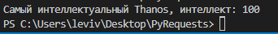
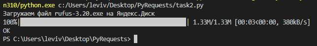
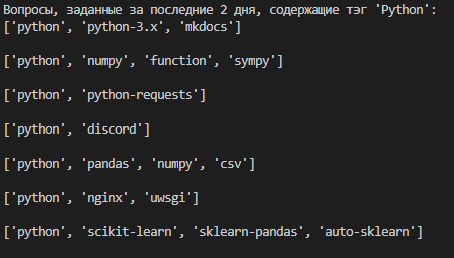

# Задача № 1
## Кто самый умный супергерой?
* TOKEN - константа;
* urls - адреса запросов;
* get_requests(url_all) - получаем список адресов и возвращаем объект страницы;
* parse() - парсим API о супергероях и опеределяем самого интеллектуального из них.

# Задача № 2
## Яндекс.Диск
Программа, принимающая на вход путь до файла на компьютере и сохраняет на Яндекс.Диск с таким же именем.

* Все ответы приходят в формате json;
* Загрузка файла по ссылке происходит с помощью метода put и передачи туда данных;
* Токен можно получить кликнув на полигоне на кнопку "Получить OAuth-токен".

HOST: https://cloud-api.yandex.net:443

# Задача № 3
## Stackoverflow

Программа выводит все вопросы за последние два дня, содержащие тэг 'Python'.

